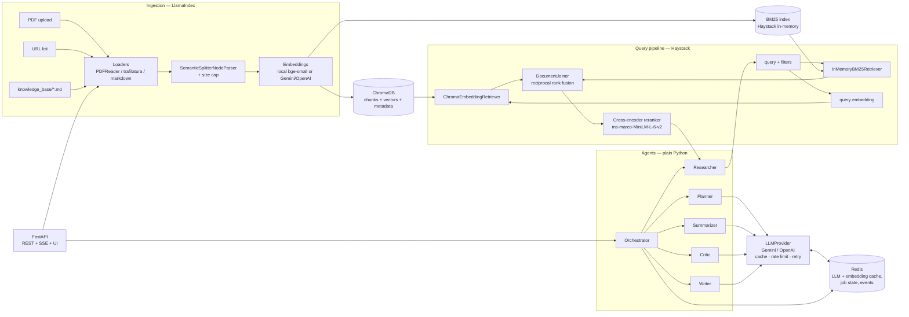
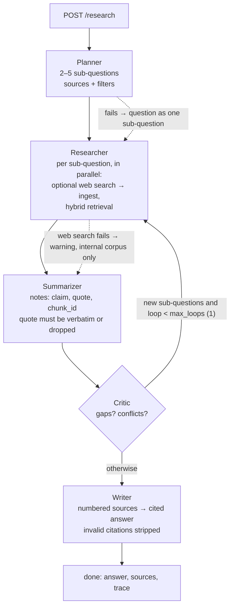

# MARA — Multi-Agent Research Assistant

Ask a research question over your own documents and get an answer in which **every factual
sentence carries a citation you can click**, plus a trace of how the system got there.

MARA plans the question into sub-questions, retrieves evidence with hybrid search (BM25 +
dense + cross-encoder reranking) over PDFs, web pages and an internal knowledge base,
summarises it into evidence notes that must quote their source verbatim, checks coverage,
and writes the answer.

## The problem

A single "stuff everything into one prompt" call cannot show where a claim came from, and a
plain RAG call retrieves once with the user's wording and hopes. Research questions are
compound ("compare X and Y, and explain when Z fails"), sources disagree, and a confident
wrong answer is worse than "the corpus does not say". MARA's design goals:

1. **No citation without evidence**: a claim survives only if code can find its quote in the
   cited chunk.
2. **Say what is missing**: gaps and failed steps end up in the answer, not hidden.
3. **Explainable control flow**: plain Python, one state object, a trace per run.

## Architecture



## Agent flow



| Agent | Job | Guarantee enforced in code |
|---|---|---|
| Planner | question → 2–5 sub-questions with sources (`kb`/`pdf`/`web`) + filters | ids renumbered, sources clamped to what the request allows |
| Researcher | hybrid retrieval per sub-question; optional web search → fetch → clean → ingest | failures become warnings, never abort |
| Summarizer | chunks → notes `{claim, supporting_quote, chunk_id}` | quote must be a verbatim substring of the chunk or the note is dropped |
| Critic | gaps, conflicts, up to 3 new sub-questions | coverage computed from verified notes; at most `max_loops` extra rounds |
| Writer | numbered sources → markdown answer with `[n]` citations | citations to unknown sources stripped; coverage recorded |

## Stack — one clear job each

| Component | Job |
|---|---|
| **LlamaIndex** | ingestion: `PDFReader`, `SemanticSplitterNodeParser` (semantic chunking), `SentenceSplitter` baseline |
| **Haystack 3** | query pipeline: `InMemoryBM25Retriever` + `ChromaEmbeddingRetriever` → `DocumentJoiner` (RRF) → `SentenceTransformersSimilarityRanker` |
| **ChromaDB** | persistent vector store with metadata filtering, shared by both frameworks (one chunk schema: `mara/core/schema.py`) |
| **Redis** | LLM / embedding / web-search cache with TTLs, research-job state and event log |
| **FastAPI** | REST API, SSE progress stream, the single-page UI |
| **Gemini / OpenAI** | generation behind one `LLMProvider` protocol (structured JSON output, validated) |
| **sentence-transformers** | local embeddings (`bge-small-en-v1.5`) and cross-encoder reranking on a laptop CPU |
| **Docker Compose** | `api` + `redis` + `chroma` |

Why both LlamaIndex and Haystack, and every other choice: [docs/DECISIONS.md](docs/DECISIONS.md).

## Evaluation

### Retrieval (`make eval-retrieval`)

35 questions over the sample corpus (18 documents, 317 chunks), graded at the level of the
relevant markdown section / PDF document. Laptop CPU, semantic chunking, local
`bge-small-en-v1.5` embeddings. Run on 2026-09-30.

| Configuration | Recall@5 | MRR@10 | mean latency (ms) | p50 latency (ms) |
|---|---|---|---|---|
| BM25 only | 0.871 | 0.797 | 4 | 4 |
| Dense only | 0.857 | 0.809 | 36 | 35 |
| Hybrid (RRF) | 0.914 | 0.790 | 53 | 53 |
| Hybrid + rerank | 0.929 | 0.871 | 1790 | 1835 |

Hybrid retrieval recovers what either leg misses; the cross-encoder fixes the ordering at a
cost of ~1.8 s per query on a CPU. Two of the 35 questions were missed by every
configuration: on-topic PDF chunks outranked the single labelled KB section (a labelling
limitation, recorded rather than hidden). The corpus is small, so treat the *ordering* of
configurations as the result, not the absolute values.

### Answer quality (`make eval-answers`)

`eval/answer_eval.json` has 15 research questions (one deliberately unanswerable). The
script reports citation coverage, citation validity (the cited quote occurs verbatim in the
cited chunk) and an LLM-as-judge faithfulness score that sees only the cited excerpts.

Run on 2026-10-01 against the sample corpus with `gemini-2.5-flash`, local embeddings and
reranking, no web search, `max_loops=1`:

| Metric | Value |
|---|---|
| Questions finished | 15 / 15 |
| Citation coverage (mean) | 0.958 |
| Citation validity (mean) | 1.000 |
| Faithfulness, LLM-as-judge (mean) | 0.699 |
| Sources per answer (mean) | 3.9 |
| Notes dropped by the quote check (total) | 11 |
| Runs that used the extra critic round | 13 of 15 |
| Answers that state a gap explicitly | 11 (designed-in on 1 question) |
| LLM calls per run (mean) | 8.1 |
| Tokens per run (mean) | 12,809 |
| Latency per run (mean) | 43 s |

Reading it honestly:
- Validity is 1.0 by construction: only notes whose quote was found verbatim reach the writer.
  The quote check rejected 11 notes across the 15 runs.
- Coverage of 0.96 means about 1 sentence in 25 was written without a citation.
- **Faithfulness of 0.70 is the weak number.** The judge sees one excerpt per source (the
  quote of the first note from that chunk), while the writer saw every claim extracted from
  it, so sentences resting on a second quote from the same chunk are judged unsupported. Part
  of the gap is that measurement limit and part is the writer generalising beyond its quotes;
  the eval does not yet separate the two. Showing the judge all quotes per source is the next
  fix. The lowest score (0.31) was on the simplest question, answered from only 2 sources.
- The critic asked for another round in 13 of 15 runs and 11 answers state a gap, which is
  more than the corpus warrants: the critic prompt is too eager. The unanswerable question
  (throughput numbers) was correctly answered with "no evidence was found".
- One model, one run per question, small corpus: treat these as a first measurement.

## Run it

Local, no Docker (embedded on-disk Chroma, in-memory job store, local models) — the path
this project was built and verified on:

```bash
uv sync
cp .env.example .env              # add GEMINI_API_KEY (or OPENAI_API_KEY + LLM_PROVIDER=openai)
make run-local                    # http://localhost:8080/  (UI; API docs at /docs)
make ingest-sample                # 10 KB notes, 3 Wikipedia PDFs, 5 Wikipedia pages
make eval-retrieval               # the retrieval table above
make demo                         # one research question end to end (needs the LLM key)
```

With Docker (adds real Redis and a Chroma server; provided but untested, see Limitations):

```bash
docker compose up --build         # api :8080, redis, chroma
```

Search and ingestion work with no API key (embeddings and reranking are local); research
runs need one. Development:

```bash
make test        # 112 tests: fake LLM, fake embeddings, fakeredis, embedded Chroma
make lint        # ruff check + format check
make compare-chunking   # semantic vs fixed-size chunk boundaries on one document
```

## API

| Endpoint | What it does |
|---|---|
| `GET /` | single-page UI: ask, watch agent steps stream, read the cited answer, expand the trace |
| `POST /research` | start a run → `202 {job_id}` |
| `GET /research/{id}` | status, answer, sources, evidence, critique, warnings, trace |
| `GET /research/{id}/events` | server-sent events, one per agent step |
| `POST /search` | the retrieval pipeline alone (`mode`: bm25 / dense / hybrid, `rerank`, filters) |
| `POST /ingest/pdf` · `/ingest/url` · `/ingest/kb` | ingest a PDF upload, a URL list, or re-scan `knowledge_base/` |
| `GET /documents` · `DELETE /documents/{id}` | list with filters (`source_type`, `tag`, dates, `q`), delete |
| `GET /health` | per-dependency status; `degraded` instead of failing when something is down |

## Layout

```
mara/core       config, Chunk schema + Chroma layout, metadata filters, ChunkStore, cache
mara/llm        LLMProvider protocol, Gemini/OpenAI adapters, local embeddings, retry, cache
mara/ingest     LlamaIndex loaders (PDF / HTML / markdown), semantic + fixed chunkers, pipeline
mara/retrieval  Haystack pipelines: BM25 + dense → RRF → cross-encoder; own rrf.py; BM25 index
mara/agents     Planner, Researcher, Summarizer, Critic, Writer, orchestrator, jobs, web search
mara/api        FastAPI app, routes, UI
mara/static     index.html (plain HTML + JS, no build step)
prompts/        one prompt file per LLM-facing agent (+ the eval judge)
knowledge_base/ internal KB: markdown notes with frontmatter
sample_corpus/  CC BY-SA Wikipedia PDFs + URL list
eval/           retrieval + answer-quality evals
scripts/        ingest_sample_corpus.py, compare_chunking.py, demo.py
docs/           ARCHITECTURE.md, DECISIONS.md, LEARNING.md, INTERVIEW.md
```

[docs/ARCHITECTURE.md](docs/ARCHITECTURE.md) walks one query through every file and function.

## Limitations

- Live runs so far use Gemini only; the OpenAI adapter is tested against a stub client, not
  the real API.
- Judge-scored faithfulness is 0.70 and the critic loops too readily (see Evaluation).
- **`docker compose up` was not executed in the build environment** (no Docker daemon); the
  non-Docker path (`make run-local`) and CI were.
- Small sample corpus: retrieval numbers are optimistic in absolute terms.
- Reranking costs ~1.8 s per query on a CPU.
- Research jobs are in-process asyncio tasks: they do not survive an API restart.
- The BM25 index lives in memory and is rebuilt from Chroma at startup (fine to ~100k chunks).
- Pages fetched by web search are ingested permanently (tagged `web-search`).
- Verbatim-quote checking drops a true claim when the model fails to copy its quote exactly.
- English only (sentence tokenizer, embedding model, reranker).

## Future work

- Job queue (Arq/Celery) so runs survive restarts and scale across workers.
- OpenSearch (keyword + vector in one engine) in place of in-memory BM25 + Chroma at scale.
- ONNX / quantised reranker, or rerank fewer candidates, to cut the 1.8 s.
- One summariser call for all sub-questions to cut LLM calls per run.
- Human-labelled answer set for completeness; richer retrieval labels (multiple relevant units).
- Streaming the writer's tokens over the existing SSE channel.
